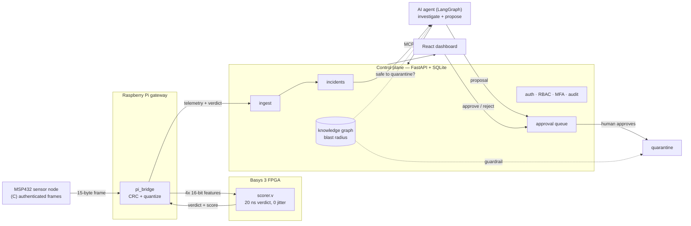

# AEGIS — Architecture

AEGIS is a secure-by-design, hardware-accelerated edge-security pipeline. One
sentence captures the whole thing:

> **Don't trust data unless you can prove where it came from, check it fast, and
> have a smart system watch over it — with a human in control of any action.**

That single idea threads every layer: the sensor *proves* the data, the FPGA
*checks it fast*, the AI agent *watches*, and a human *stays in control*.

## Data flow

## Layers

| Layer | Tech | Responsibility |
|-------|------|----------------|
| **Sensor node** | MSP432 · C | Sample link stats, build an authenticated framed binary message (length prefix, sequence number, CRC-16). |
| **Gateway** | Raspberry Pi · Python | Parse frames, verify CRC, quantize features, drive the FPGA, forward verdicts. |
| **FPGA scorer** | Basys 3 · Verilog | Score each message for anomalies at deterministic 20 ns latency (the trained tree, quantized into hardware). |
| **Control plane** | FastAPI · SQLAlchemy · SQLite | System of record: telemetry, incidents, investigations, users; auth/RBAC/MFA/audit; approval workflow. |
| **Knowledge graph** | Python (+ Neo4j/Cypher) | Model the topology; answer "what breaks if we quarantine X?" (blast radius, single points of failure). |
| **AI agent** | LangGraph · Anthropic | Investigate an anomaly via tools + runbook RAG; propose a remediation behind a human-approval gate. |
| **Dashboard** | React · TS · Vite | Live topology graph, anomaly feed, and the approval queue. |
| **Data tier** | Python | Train + quantize the model; produce the evaluation report. |
| **DevOps** | Docker · GitHub Actions | Containerize; CI runs the whole test suite on every push. |

## The trust spine (why each hop exists)

1. **Provenance** — each frame is sequenced and CRC-checked; the gateway drops
   anything that fails, so tampered or replayed messages are caught at the byte
   level. (Stretch: on-chip AES/SHA authentication + measured boot.)
2. **Speed & determinism** — the FPGA gives a verdict in exactly 2 cycles
   (20 ns @ 100 MHz) with **zero jitter**, and the *same* model runs as Python
   and as Verilog, verified bit-exact across 500 vectors.
3. **Reasoning** — on an anomaly, the agent pulls telemetry, searches runbooks,
   and checks the knowledge graph *before* proposing anything.
4. **Human control** — the agent has **no** tool that acts. It can only propose;
   a human approves via the dashboard. A hard guardrail refuses to quarantine a
   single point of failure even if a human approves it by mistake.

## Security model

- **AuthN** — bearer tokens; static service tokens for machine clients, and
  **TOTP MFA** login (`/auth/login`) issuing short-lived session tokens for humans.
- **AuthZ** — role ladder **viewer < operator < admin**, enforced per endpoint.
- **Audit** — every mutating action (ingest→incident, quarantine, approve/reject,
  login) is written to an append-only log with the *authenticated* actor.
- **Guardrail** — blast-radius check blocks quarantining a single point of failure
  on both the agent path and the API decision path.

## Verification & CI

Every push runs (`.github/workflows/ci.yml`):

- **Control plane** — approval workflow + guardrail, auth/RBAC/audit, TOTP MFA,
  and the full end-to-end pipeline (`e2e_pipeline.py`).
- **FPGA + embedded** — model build, evaluation report (regression-gated), RTL
  correctness + latency sims (Icarus Verilog), and the C↔Python protocol test.
- **Docker** — control-plane image build.

Everything above runs on a laptop — no FPGA board or sensor hardware required.
